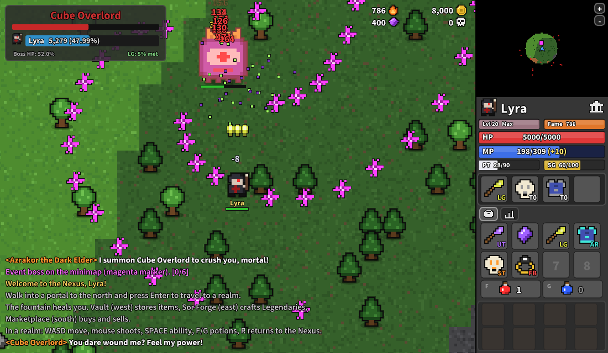
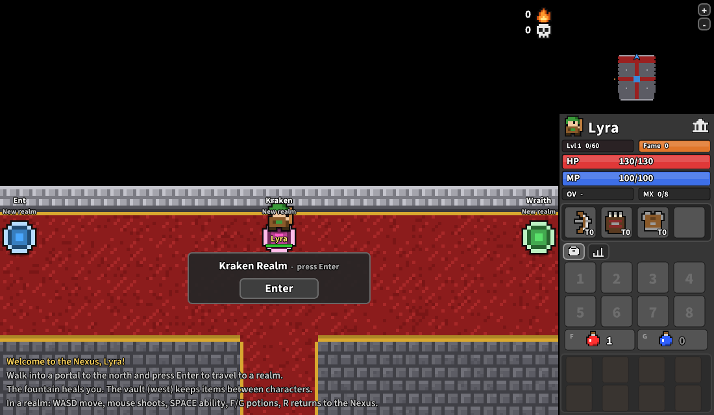

# New Realm

A top-down bullet-hell adventure inspired by *Realm of the Mad God*, written in pure
ActionScript 3 for **Adobe AIR**. All of the pixel art is generated in code: 8x8 sprites
scaled 5x with thin outlines and drop shadows, textured tiles, and rotated projectiles.




## Play it

A pre-built `bin/NewRealm.swf` is included, so you only need an AIR SDK
([HARMAN AIR SDK](https://airsdk.harman.io/), or the old Adobe AIR SDK 32).

```sh
# macOS / Linux
AIR_SDK=/path/to/AIRSDK ./run.sh

# Windows
set AIR_SDK=C:\AIRSDK
run.bat
```

`run` opens the game with `adl`, the AIR Debug Launcher. To get a standalone app you can
double-click, run `package.sh` / `package.bat`. It builds a captive-runtime bundle in
`dist/NewRealm` and creates a self-signed certificate the first time.

After changing the code, rebuild with `build.sh` / `build.bat` (uses `amxmlc`).
The source also compiles with the Apache Flex SDK's `mxmlc`, and the SWF runs in
Flash Player or Ruffle.

The UI font is Source Sans Pro (SIL Open Font License, see `assets/fonts/`). It is
precompiled into `assets/fonts/RealmFonts.swf` and loaded at startup. You only need to
rebuild that file if you change the fonts, and that needs the Apache Flex SDK's `mxmlc`
(see `assets/fonts/RealmFonts.as`).

## Controls

| Key | Action |
| --- | --- |
| WASD / arrows | Move |
| Mouse | Aim; hold left button to shoot |
| Space | Class ability (aimed at cursor) |
| F / G | Drink health / magic potion |
| 1-8 | Use or equip the item in that inventory slot |
| R | Return to the Nexus (full heal) |
| Enter | Go through the portal you are standing on |
| I | Toggle auto-fire |
| P / Esc | Pause |

To pick up loot, stand on a loot bag and click its items in the sidebar. Click an
inventory item to equip or drink it, and shift+click to drop it.

## Features

The game is modelled closely on **Valor**, the RotMG private server. Its systems come from
the public [Valor wiki](https://github.com/Valor-Inc/Wiki); the names and pixel art are original.

- **8 classes with Valor's stat tables**: Wizard (Spell), Archer (Quiver), Knight (Shield),
  Priest (Tome), Rogue (Cloak, invisibility), Warrior (Helm, berserk), Necromancer (Skull,
  life-draining blast) and Huntress (Trap).
- **11 maxable stats ("11/11")**: the vanilla 8 plus Valor's **Might** (crit damage, +0.1x per
  10), **Luck** (crit chance, +1% per 10) and **Protection**. Gear can also add **Fortune**
  (+1% loot chance per point).
- **PT and SG bars**: Protection fills a white **PT** shield (about 3 PT per point) that
  absorbs damage before HP. **Surge** gains +2 for each kill near you and refills PT at 100.
- **Valor item tiers**: T0-T7, then **UT**, **ST** (set items; 4 pieces give a set bonus),
  **FB** (Fabled), **LG** (Legendary, with passives such as Lifebloom, Shardstorm,
  Frostbite, Executioner and Rampage) and **AR** (Ancient Relic). Each has its own coloured
  tag and loot bag.
- **Currencies**: account-wide **Gold** and **Onrane**, plus account Fame.
- **The Nexus**: realm portals, a healing fountain, the vault, the **Sor Forge** (a UT, ST
  or FB item + a Sor Crystal + 100 Onrane = a Legendary) and the **Marketplace** (buy
  potions, stat potions, Sor Crystals and mystery UTs, and shift+click items to sell them).
- **Realm events**: the realm's overlord, *Azrakor the Dark Elder*, keeps summoning event
  bosses (Cube Overlord, Ember Titan, Frost Wyrm, Hollow King) and announces each kill in
  chat as `[3/6][Realm: Medusa]`. Clear all 6 events and the realm closes. You're pulled
  into the **Dark Elder's Chamber**, a white arena ringed in red bloodstone, to fight him
  for Fabled, Legendary and Relic loot.
- **Dungeons**: event bosses often drop a portal (open for 90 seconds) to one of three
  dungeons: the Sunken Crypt, the Ember Depths (lava pools) or the Storm Spire. Each is a
  chain of monster rooms with a boss at the end (the Crypt Warden, Pyrelord Ignaar or the
  Tempest Seraph).
- **Skill tree (Valor's Ascension)**: at level 20 with 11/11 stats, every 600 XP gives a
  skill point. Spend points on 9 nodes (Brutality, Precision, Ferocity, Vigor, Bulwark,
  Aegis, Swiftness, Leech, Prosperity) in the star tab.
- **Saved characters**: characters are saved automatically and live until they die. The
  title screen lists them under "Your Characters".
- **Boss damage meter** with your damage share and the LG threshold.
- Procedurally generated island realms: Shore → Lowlands → Midlands → Godlands, with brick
  ruins and lava.
- Permadeath. Fame from a dead character is added to your account.

## Code layout

```
src/NewRealm.as          entry point / screen switching
src/realm/Game.as        game loop, collisions, spawning, rendering
src/realm/World.as       island generation and tile rendering
src/realm/Player.as      movement, shooting, abilities, levelling, items
src/realm/Enemy.as       AI and bullet patterns
src/realm/Data.as        classes, enemies, items, loot tables (balance lives here)
src/realm/Sprites.as     text-defined pixel art, bullets, icons
src/realm/Hud.as         sidebar UI (minimap, bars, gear, inventory, loot bag)
src/realm/Tooltip.as     item tooltip
src/realm/Ui.as          fonts, text, panels and buttons
src/realm/Menu.as        title / class select
src/realm/DeathScreen.as death + fame screen
```

To add a monster, add an entry to `Data.ENEMIES` (and optionally a sprite to
`Sprites.DEFS`), then list it in `Data.ZONE_SPAWNS`.
