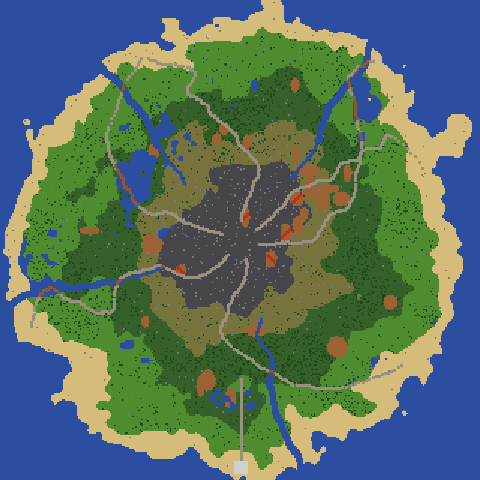

# New Realm

A top-down bullet-hell adventure inspired by *Realm of the Mad God*, written in pure
ActionScript 3 for **Adobe AIR**. All of the pixel art is generated in code: 8x8 sprites
scaled 5x with thin outlines and drop shadows, textured tiles, and rotated projectiles.




## Play it

A pre-built `bin/NewRealm.swf` is included, so you only need an AIR SDK
([HARMAN AIR SDK](https://airsdk.harman.io/), or the old Adobe AIR SDK 32).

**Windows:** unzip the AIR SDK to `C:\AIRSDK` (so `C:\AIRSDK\bin\adl.exe` exists), then
double-click `run.bat`. It also finds SDK folders named `AIRSDK*` in your user folder,
Downloads or Desktop, or next to the game folder. If yours is somewhere else, either put
its path on one line in a file called `airsdk.txt` next to `run.bat`, or `set AIR_SDK=...`
first. If anything goes wrong, the window stays open and shows the error.

**macOS / Linux:**

```sh
AIR_SDK=/path/to/AIRSDK ./run.sh
```

`run` opens the game with `adl`, the AIR Debug Launcher. To get a standalone app you can
double-click, run `package.sh` / `package.bat`. It builds a captive-runtime bundle in
`dist/NewRealm` and creates a self-signed certificate the first time.

After changing the code, rebuild with `build.sh` / `build.bat` (uses `amxmlc`).
The source also compiles with the Apache Flex SDK's `mxmlc`, and the SWF runs in
Flash Player or Ruffle.

The UI font is Source Sans Pro (SIL Open Font License, see `assets/fonts/`). It is
precompiled into `assets/fonts/RealmFonts.swf` and loaded at startup. You only need to
rebuild that file if you change the fonts, and that needs the Apache Flex SDK's `mxmlc`
(see `assets/fonts/RealmFonts.as`).

## Admin menu (for testing)

Press **`** (the key under Esc) or type `/admin` in chat to open the admin menu. Close it
with ` or Esc. It has five tabs:

- **Player**: max level, max all stats (11/11), god mode, full heal, skill points, max
  potions, gold / Aether / account fame, backpack, clear inventory, a level 30 pet.
  - **World buttons:** kill all monsters, teleport to the Godlands or the Nexus, finish the
    realm's events (the realm closes and the Dark Elder fight starts), spawn an event now,
    reveal the minimap.
- **Monsters / Bosses**: every monster and boss in the game, sorted by health. Click one to
  spawn it in front of you (toward the mouse).
- **Dungeons**: open a portal to any dungeon next to you, or go straight in. Also has the
  Dark Elder's chamber and a realm portal.
- **Items**: any tier (T0-T7) or rarity (RN, BD, EL, SF, PR) of weapon, ability, armor and
  ring for your class, a full Bonded set, potions, Star Shards and every stat potion.

## Accounts and saves

The game opens on a home screen. The first time you play it asks you to **create an
account** (username and password). PLAY then takes you to character select. The top-right
box lets you log out, switch accounts or change your password, and the game remembers the
last account you used.

There is no server: accounts and saves are stored locally on this computer, in the AIR or
Flash Player local storage. Each account has its own save (characters, vault, gold,
Aether, fame, pets, skins, quests and achievements). Passwords are never stored as
plain text, only as salted SHA-256 hashes. Progress saved before accounts existed is moved
into the first account you create.

## Controls

| Key | Action |
| --- | --- |
| WASD / arrows | Move |
| Q / E | Rotate the camera |
| Z | Snap the camera back to 0 degrees |
| Mouse | Aim; hold left button to shoot |
| Space | Class ability (aimed at cursor) |
| F / G | Drink health / magic potion |
| 1-8 | Use or equip the item in that inventory slot |
| R | Return to the Nexus (full heal) |
| Enter | Go through the portal you are standing on |
| Enter (elsewhere) | Chat / commands: `/help`, `/nexus`, `/realm`, `/glands`, `/stats`, `/quests`, `/achievements`, `/who`, `/trade name`, `/inspect name`, `/tips`, `/admin` |
| Click a player (Nexus) / right-click (anywhere) | Player menu: Inspect, Trade, party / guild invite, Teleport |
| L | Party and guild window |
| I | Toggle auto-fire |
| M | Mute / unmute sound |
| P / Esc | Pause menu and settings: volume slider, mute, show players (everyone or party and guild only), player names, chat bubbles, damage numbers, particles, screen shake, Save & Quit |

**Items work like RotMG, with drag and drop:**
- **Drop:** drag an inventory item onto the ground (anywhere in the game view) to drop it in
  a loot bag.
- **Move:** drag between inventory slots to move or swap items.
- **Equip:** drag onto a gear slot to equip, or drag gear into an empty inventory slot to take it off.
- **Loot bags:** drag items between a loot bag (or the vault) and your inventory.
- **Click:** clicking an item still uses or equips it, and clicking a loot bag item picks
  it up.
- **Shift+click:** sells an item at the Marketplace, and quick-drops it anywhere else.

## Playing with friends (multiplayer)

One person hosts the server; everyone (the host too) joins it from the title screen.

### Playtest checklist

**Host, before the session**
1. Install **Node.js** (LTS, https://nodejs.org). You only need to do this once.
2. Build the game: `build.bat` then `package.bat`. You get `dist\NewRealm.zip`, a standalone
   game (no AIR install needed). Send the zip to your friends. **Everyone must use the same
   build**: the server turns away a mismatched game with a clear message.
3. Pick how friends will reach you (see below). Tailscale is easiest.

**Host, when you play**
1. Double-click **`server.bat`** and leave the window open. It shows the addresses to share.
2. Start the game, log in, click **Play Online**, enter `localhost:2050`.

**Friends**
1. Unzip `NewRealm.zip` and run `NewRealm.exe`.
2. Register an account (it's stored on your own PC), click **Play Online** and enter the
   host's address, e.g. `100.101.102.103:2050`.

**Reaching the host**
- **Same Wi-Fi:** use the `192.168.x.x:2050` address the server window shows.
- **Tailscale (easiest over the internet, no router setup):** everyone installs Tailscale
  (https://tailscale.com, free). The host shares their PC with the friends from the
  Tailscale admin page. Friends use the host's `100.x.x.x:2050` address; the server window
  marks it "(Tailscale)".
- **Port forwarding:** forward TCP port 2050 on the router to the host PC, allow it through
  Windows Firewall, and friends use the host's public IP (search "what is my ip") + `:2050`.
- **Always-on:** run `node server/server.js` on any small cloud server and open port 2050.

**Server window commands:** `list` (who's online and where), `say message` (announce to
everyone), `kick name`, `realms` (new realms for the next logins), `stop` (saves and shuts
down). Accounts and guilds are saved in `server/data/`.

### What's shared online
- **Monsters, bosses and events.** The first player in a realm or dungeon is its *host*:
  their game runs the monsters and the server streams them to everyone else there. You
  fight the same monsters, dodge the same bullets and see the same bosses. If the host
  leaves, someone else takes over automatically. The online line under the gold counter
  says "(host)" on the player who's running the area.
- **Kills and loot.** Everyone near a kill shares its XP. Loot drops for each player who hit
  the monster (RotMG-style: your bags are yours).
- **Dungeons.** Portals that drop in a realm appear for everyone there and lead to the same
  dungeon. `/join name` follows a party or guild member wherever they are. When a realm
  closes, everyone from it goes to the same Citadel and the same Dark Elder fight.
- **Realms.** The server picks the three realms and everyone gets the same maps.
- **Players and social.** Positions and shots; public, party (`/p`) and guild (`/g`) chat;
  trades (both players accept the same offer); parties (6); guilds (27, saved on the server).
- **Reconnects.** If the connection drops, the game keeps running and reconnects by itself.
  The online line shows your ping.

### Known limits for the playtest
- Characters, items and gold are saved on each player's own PC; the server only stores
  account names and guilds. So a modified game could cheat. That's fine among friends.
- Each player's monster hits are checked by their own game (no lag when dodging), so a laggy
  player's view of a monster can be a few tiles behind the host's.
- Your name on a server is protected by a secret key your game makes the first time you
  join. If you change PC or wipe your game data, the host can free the name by deleting
  your entry from `server/data/accounts.json` (with the server stopped).

Server options: `server.bat 3000` runs on port 3000. The server speaks plain TCP for the
game and WebSocket on the same port (for browser builds).

## Other players and trading

When you play offline, the other players are simulated on your computer (`LocalNet.as`).
Online, the same features talk to the real server (`ServerNet.as`).

- **Inspect:** click a player in the Nexus (or right-click anywhere, or `/inspect name`) to
  see their class, level, fame, maxed stats and equipment, with item tooltips.
- **Trade:** choose Trade from the player menu, or type `/trade name`. In the trade window:
  - Click your own items to offer them (green).
  - Click the other player's items to ask for them (gold outline).
  - What they offer turns green.
  - Any change un-ticks both Accepts. Accept unlocks a moment after the last change, so
    nothing can be swapped at the last second.
  - Both players accept, and the items swap.
- Players sometimes ask to trade with you, and they advertise what they're selling in chat.
  Simulated traders want a fair deal: they say how much more they want, and value stat
  potions and Star Shards highly.
- In the realms other players fight monsters too. You share the XP from kills near you,
  but loot only drops for monsters you hit yourself.
- Other players show as yellow dots on the minimap.

**Parties** (up to 6 players)
- Invite someone from the player menu or with `/party invite name`.
- Party members follow you into realms and dungeons and fight beside you.
- Party members have blue names and blue minimap dots.
- `/p message` is party chat.

**Guilds** (up to 27 members)
- Found one for 1,000 gold with `/guild create Name`.
- Officers and above can invite. Ranks are Initiate, Member, Officer, Leader and Founder;
  promote, demote and kick from the guild window (L).
- `/g message` is guild chat. Guild members have green names, and online members hang out
  in the Nexus.
- You can teleport to party and guild members (`/tp name`, 10s cooldown).
- Setting: **Show players: Party & guild** hides everyone else (their sprites, names, chat and shots).

**Weapon forms:** half of all dropped weapons come in a form that changes how they shoot.

| Form | What it does |
| --- | --- |
| Heavy | One big, slow-firing shot that hits very hard (good against armor) |
| Farshot | Much longer range, a little less damage |
| Brutal | Short range, a lot more damage |
| Scattershot | Two extra shots in a wide spread; each hits softer |
| Swift | Fires much faster; each shot hits softer |
| Siege | Slow, heavy shots that pierce through everything |
| Serpent | Shots weave in a wave |
| Returning | Shots fly out and come back, hitting on both passes |

**Loot for every class:** monsters drop weapons, abilities and armor for every class, not just
yours. Half of gear drops are for your own class; the rest can be for any class. Gear your
class can't use has a red slot, and its tooltip says which classes can use it. You can still
trade it, store it in the vault or sell it.

**Abilities:** ability tooltips explain what the ability does, with its damage, healing and
duration at your level, and its MP cost.

**Water:** lakes and rivers can be waded through at half speed (you sink in up to your
waist). The open sea is still impassable.

## Features

The game is set on **Eldmere**, an island of realms ruled by Azrakor the Dark Elder. It plays
like Realm of the Mad God, but its names, systems and pixel art are New Realm's own.

- **8 classes**: Wizard (Spell), Archer (Quiver), Knight (Shield),
  Priest (Tome), Rogue (Cloak, invisibility), Warrior (Helm, berserk), Necromancer (Skull,
  life-draining blast) and Huntress (Trap).
- **11 maxable stats ("11/11")**: the classic 8 plus **Fury** (crit damage, +0.1x per
  10), **Focus** (crit chance, +1% per 10) and **Warding**. Gear can also add **Bounty**
  (+1% loot chance per point).
- **Ward and Fervor bars**: Warding fills a white **Ward** shield (about 3 per point) that
  absorbs damage before HP. **Fervor** gains +2 for each kill near you and refills your Ward at 100.
- **Item tiers and rarities**: tiered gear T0-T7, then New Realm's own rarities, from common
  to rarest. Each has its own colour, tag and loot bag.

  | Rarity | Tag | Colour | What it is |
  | --- | --- | --- | --- |
  | **Runed** | RN | azure | Rare drops from events, dungeons and the Godlands |
  | **Bonded** | BD | jade | Class sets, such as the Wizard's Archmage's set or the Knight's Crusader's set; wearing all 4 pieces gives a set bonus |
  | **Eldritch** | EL | violet | Dropped by the Dark Elder |
  | **Starforged** | SF | gold | Made at the forge, or very rare drops. Weapons carry passives such as Lifebloom, Shardstorm, Frostbite, Executioner and Rampage |
  | **Primordial** | PR | ember red | The rarest drops |
- **Currencies**: account-wide **Gold** and **Aether**, plus account Fame.
- **The Nexus**: realm portals, a healing fountain, the vault, the Pet Yard, the Fame Store, the **Starforge** (a Runed, Bonded
  or Eldritch item + a Star Shard + 100 Aether = a Starforged item) and the **Marketplace** (buy
  potions, stat potions, Star Shards, mystery Runed items and a **Backpack**, and shift+click items to sell them). A
  backpack gives that character 8 more inventory slots. Switch pages with the button by
  the sidebar tabs; keys 1-8 use the page you're on.
- **Fame Store** (Nexus, north-west): spend account fame on skins, two per class, such as
  Frost Mage, Dark Knight, Ghost (Rogue) and Plague Doctor (Necromancer). Skins cost
  400 or 1,000 fame. Once bought, a skin can be equipped by any character of that class.
- **Pet Yard**: hatch a pet egg (1,000 gold) in the Nexus to get one of six pets (Realm
  Pup, Jelly, Night Owl, Ember Drake, Wisp, Pebble Golem). Pets are Common, Rare or
  Legendary. They follow you, heal HP and MP every 3 seconds, and level up with every kill
  (or when you feed them gold). Rarer pets reach higher levels. Your pet is shared by all
  your characters and survives their deaths.
- **Graveyard**: the title screen lists your 30 most recently fallen heroes. Each entry shows
  the hero's level, kills, fame and what killed them.
- **Realm events**: the realm's overlord, *Azrakor the Dark Elder*, keeps summoning event
  bosses (Cube Overlord, Ember Titan, Frost Wyrm, Hollow King, Gorehorn the Behemoth, the
  Phantom Regent) and announces each kill in
  chat as `[3/6][Realm: Ashveil]`. Clear all 6 events and the realm closes. You storm
  **Azrakor's Citadel** and then the **Dark Elder's Chamber**, a white arena ringed in red bloodstone, to fight him
  for Eldritch, Starforged and Primordial loot. At a third of his health he becomes immune and
  summons four Elder Crystals. Destroy them all to make him vulnerable again.
- **Dungeons**: event bosses often drop a portal (open for 90 seconds) to one of four
  dungeons: the Sunken Crypt, the Ember Depths (lava pools), the Storm Spire or the
  Forgotten Cellar. Each is a chain of monster rooms with a boss at the end (the Crypt
  Warden, Pyrelord Ignaar, the Tempest Seraph or the Cellar Sorcerer). Most dungeons also
  have a side treasure room with a guarded chest holding a set piece and stat potions.
- **Chat and commands** (Enter): `/glands` teleports you to the Godlands, plus
  `/nexus`, `/realm`, `/stats` and `/quests`. One-time tips guide new players.
- **Skill tree (Awakening)**: at level 20 with 11/11 stats, every 600 XP gives a
  skill point. Spend points on 9 nodes (Brutality, Precision, Ferocity, Vigor, Bulwark,
  Aegis, Swiftness, Leech, Prosperity) in the star tab.
- **Saved characters**: characters are saved automatically and live until they die. The
  title screen lists them under "Your Characters".
- **Status effects**: bosses and dungeon enemies can leave you Slowed, Paralyzed, Confused
  (controls reversed), Armor Broken (0 Defense) or Bleeding (draining HP, no regen).
- **Sound effects**, all synthesised in code: shots, hits, kills, level-ups, loot, rare-drop
  chimes, portals and boss spawns. A banner announces Eldritch, Starforged and Primordial drops.
- **Daily Quest Board**: three missions picked by date, such as
  "Clear a dungeon" or "Defeat 2 realm event bosses", paying gold and Aether.
- **Quest arrow** (like RotMG's quest marker): a gold arrow at the edge of the screen points
  to your current objective, with its name and distance. That's the area boss, the nearest
  Elder Crystal while the Dark Elder is immune, or a monster suited to your level.
- **Achievements**: 16 account-wide goals, such as First Blood, Dungeon Master, Treasure
  Hunter, Bane of Azrakor and Perfection (11/11). Each pays gold and Aether once. See them
  at the Quest Board, or type `/achievements`.
- **Screen shake** on heavy hits, explosions and boss deaths.
- **Pause menu** with Resume, sound, damage numbers, particle and screen shake toggles, and Save & Quit
  to the title screen.
- **Boss damage meter** with your damage share and the loot threshold.
- **RotMG-style realms**: a big procedurally generated island (320x320 tiles) with five
  biomes from the coast inwards: **Beach → Lowlands → Midlands → Highlands → Godlands**.
  There are cobblestone roads running inland with bridges over rivers, lakes, shallows,
  forests in the Midlands, rocky Highlands, and brick and lava ruins.
- **More monsters**: 7-9 types per biome, including leaders drawn bigger than normal
  monsters:
  - Beach: Pirates, Pirate Brawlers, the Pirate Captain, Sand Scorpions.
  - Lowlands: Big Green Slimes, the Goblin Chieftain, the Bandit Leader.
  - Midlands: Forest Spiders, the Spider Queen, Swamp Serpents, the Orc King.
  - Highlands: Harpies, Dwarves and the Dwarf King, Ogres, Minotaurs.
  - Godlands: Ghost Gods, White Demons, Sprite Gods, Slime Gods, plus the classic Godlands
    monsters.
- **Monster dungeons**: like RotMG, monsters can drop a portal (open for 60 seconds) to
  their own dungeon:

  | Dropped by | Dungeon | Boss |
  | --- | --- | --- |
  | Pirates | Pirate Cove | Captain Saltbeard |
  | Big Green Slimes | Forest Maze | Mother Mothwing |
  | Snakes | Snake Pit | Ssythra the Serpent Queen |
  | Spiders | Spider Den | Arachnia the Broodmother |
  | Ghost Gods / Liches | Undead Lair | Septorius the Lich King |
  | White Demons | Abyss of Demons | Malgoroth the Archdemon |
  | Sprite Gods | Sprite World | Lumina the Sprite Queen |

  Leaders such as the Pirate Captain and Spider Queen drop their portal far more often.
  Low-level dungeons drop good tiered gear and sometimes a Runed item.
- **Hard multi-boss dungeons**: elite monsters (about 1.5-1.7x health and harder hits) and the
  best loot outside the Dark Elder.
  - **Azrakor's Citadel**: when a realm closes you storm the Dark Elder's Citadel. Kill his two
    lieutenants, Kael'zar the Blood Knight and Morwyn the Hex Queen, and the way to his chamber
    opens.
  - **Tomb of the Three Kings**: Solhar the Sun King, Lunara the Moon Queen and Astrel the
    Star Prince fight you together in the last hall. Every king that falls heals the others a little
    and makes them hit harder. Dropped by the Sand Sphinx.
  - **The Shattered Sanctum**: Glacius the Frost Warden and Ignivar the Flame Warden guard the
    sealed Shattered Seraph, who can't be hurt until both Wardens are dead. Dropped by the
    Phantom Regent and the Lord of the Sunken Lands.

  With several bosses in a dungeon, the boss health bar and quest arrow follow whichever boss is
  nearest.
- **10 realm events**, picked at random, now including Nekhret the Sand Sphinx, the Lord of the
  Sunken Lands, the Tide Hermit and the Skull Shrine.
- Permadeath. Fame from a dead character is added to your account. Like RotMG, the death
  screen lists **fame bonuses**:
  - Ancestor: the first hero of a class to die.
  - Thirsty: level 20 without drinking a stat potion.
  - Well Equipped: wearing four Runed or better items.
  - Set Master: wearing a full set.
  - Well Fed / Fully Maxed: 8/11 or 11/11 maxed stats.
  - Tunnel Rat: 3+ dungeons cleared.
  - Realm Hero: 6+ bosses killed.
  - Elder Slayer: killed the Dark Elder.
  - Godlands Hunter: 100+ Godlands kills.
  - Accurate: hit with 40%+ of your shots.

## Code layout

```
src/NewRealm.as          entry point / screen switching
src/realm/Game.as        game loop, collisions, spawning, rendering
src/realm/World.as       island generation and tile rendering
src/realm/Player.as      movement, shooting, abilities, levelling, items
src/realm/Enemy.as       AI and bullet patterns
src/realm/Data.as        classes, enemies, items, loot tables (balance lives here)
src/realm/Sprites.as     text-defined pixel art, bullets, icons
src/realm/Hud.as         sidebar UI (minimap, bars, gear, inventory, loot bag)
src/realm/Tooltip.as     item tooltip
src/realm/Net.as         connection to other players (the seam for the game server)
src/realm/Online.as      socket connection to a New Realm server
src/realm/ServerNet.as   online Net: real players, chat, parties, guilds, trades
src/realm/WorldSync.as   shared monsters online (world host streams monsters to the others)
server/server.js         the multiplayer server (Node.js, no dependencies)
src/realm/LocalNet.as    offline Net: simulated players who chat, fight and trade
src/realm/RemotePlayer.as another player (position smoothing, public profile)
src/realm/TradeSession.as trade rules (offers, accept lock, space check, swap)
src/realm/TradeWindow.as trade screen; InspectWindow.as player inspect screen
src/realm/SocialWindow.as party and guild window
src/realm/Ui.as          fonts, text, panels and buttons
src/realm/TitleScreen.as home screen, log in / register dialogs
src/realm/Accounts.as    local accounts (salted password hashes)
src/realm/Menu.as        character / class select
src/realm/DeathScreen.as death + fame screen
src/realm/Sfx.as         synthesised sound effects
src/realm/Save.as        local save data (characters, vault, currencies, options)
```

To add a monster, add an entry to `Data.ENEMIES` (and optionally a sprite to
`Sprites.DEFS`), then list it in `Data.ZONE_SPAWNS`.
